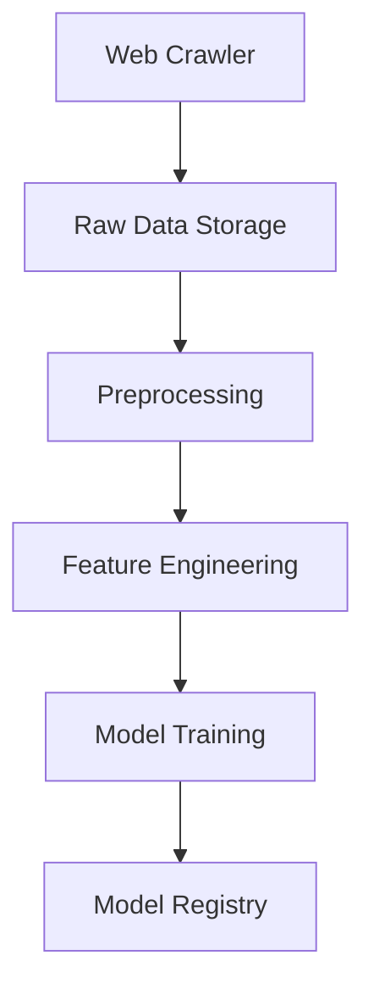

# 🛒 E-commerce Price Prediction Pipeline

This project is an **end-to-end ML Engineering pipeline** for predicting product prices using **web crawled data** from e-commerce websites.  
The pipeline is fully automated with **Apache Airflow**, starting from data crawling to model training.

---

## 📂 Project Structure
```
ecommerce_price_prediction/
│── dags/
│ └── ecommerce_pipeline.py # Airflow DAG
│── src/
│ ├── crawler.py # Web crawler (scrapes product data)
│ ├── preprocess.py # Data cleaning & preprocessing
│ ├── feature_engineering.py # Feature creation
│ └── train_model.py # Model training
│── data/
│ ├── raw/ # Raw crawled data
│ └── processed/ # Cleaned & feature-engineered data
│── models/
│ └── price_predictor.pkl # Trained ML model
│── requirements.txt # Dependencies
```


---

## ⚙️ Workflow



Step 1 – Crawler: Collects product data (title, price, rating) from an e-commerce website.

Step 2 – Preprocessing: Cleans missing values, converts prices, and normalizes data.

Step 3 – Feature Engineering: Creates additional features (e.g., rating score, price bucket).

Step 4 – Model Training: Trains a RandomForestRegressor to predict product prices.

Step 5 – Deployment (future work): Serve predictions via API (FastAPI/Flask).

# 🚀 Getting Started
1️⃣ Clone Repository
```
git clone https://github.com/your-username/Ecommerce-web_crowler.git
cd Ecommerce-web_crowler
```

---

2️⃣ Create Virtual Environment
```
python -m venv venv
source venv/bin/activate   # Linux / Mac
venv\Scripts\activate      # Windows
```

---

3️⃣ Install Dependencies
```
pip install -r requirements.txt
```

---

4️⃣ Run Each Script Individually
```
python scripts/crawler.py
python scripts/preprocess.py
python scripts/feature_engineering.py
python scripts/train_model.py
```

---

5️⃣ Run with Airflow

Start Airflow webserver and scheduler:
```
airflow db init
airflow webserver --port 8080
airflow scheduler
```

---

# Place ecommerce_pipeline.py inside dags/ folder.
Open http://localhost:8080 and trigger the DAG.

---
# 📊 Example Output
Raw data: data/raw/products_YYYYMMDD.csv

Processed data: data/processed/cleaned_data.csv

Feature data: data/processed/features.csv

Trained model: models/price_predictor.pkl

---

# 🛠️ Tech Stack

Python 3.9+

BeautifulSoup4 – Web scraping

Pandas – Data processing

Scikit-learn – Model training

Joblib – Model saving

Apache Airflow – Workflow orchestration

---

# 🔮 Future Improvements

Deploy trained model with FastAPI or Flask

Store crawled data in PostgreSQL / S3 / Delta Lake

Add MLflow for model versioning

Implement real-time price monitoring

---

# 👨‍💻 Author

Diyorbek Fozilov
ML Engineer | Data Scientist
📧 Email: diyorbekfozilov011@gmail.com

🌐 LinkedIn
 | GitHub
